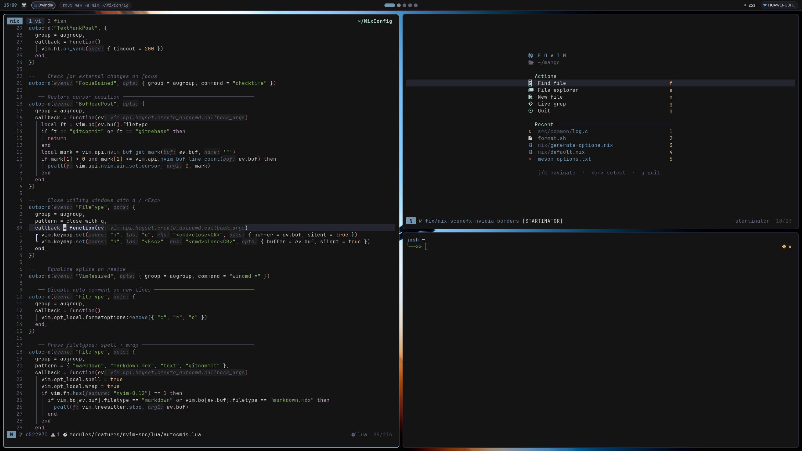
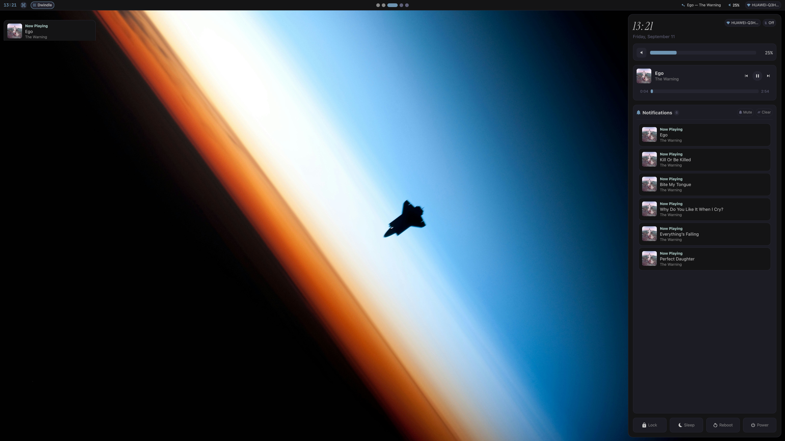

# NixConfig

<div align="center">

[-5277C3?style=for-the-badge&logo=nixos&logoColor=white>)](https://nixos.org)
[](https://github.com/nixos/nixpkgs)
[](https://flake.parts)
[](https://github.com/mightyiam/dendritic)
[](https://github.com/feel-co/hjem)
[](https://limine-bootloader.org)
[](LICENSE)

A clean, modern, and high-performance **[dendritic](https://github.com/mightyiam/dendritic)** NixOS configuration designed for daily workstation productivity, embedded systems engineering, AI-assisted development, and low-latency gaming across `desktop` (NVIDIA) and `laptop` (AMD) hardware.

</div>

---

## Screenshots




## Overview

**NixConfig** implements the dendritic architecture pattern using **`flake-parts`** and **`import-tree`**. Every `.nix` file within `modules/` is automatically discovered and composed without manual import lists.

The system pins **`nixos-26.05`** for rock-solid base operating system stability while seamlessly layering an integrated **`nixos-unstable`** overlay for bleeding-edge desktop software, terminal tooling, and development packages.

User environments and dotfiles are managed declaratively using **[hjem](https://github.com/feel-co/hjem)**, a lightweight, module-native alternative to Home Manager that integrates directly into NixOS options.

---

## Table of Contents

- [Overview](#overview)
- [System Architecture](#system-architecture)
- [Key Features](#key-features)
  - [Core System, Boot & Security](#core-system-boot--security)
  - [Networking, Mesh VPN & File Synchronization](#networking-mesh-vpn--file-synchronization)
  - [Wayland Desktop & Compositors](#wayland-desktop--compositors)
  - [Quickshell Desktop Shell](#quickshell-desktop-shell)
  - [Terminal, Shell & Multiplexer](#terminal-shell--multiplexer)
  - [Declarative Neovim & Development](#declarative-neovim--development)
  - [Artificial Intelligence & Autonomous Agents](#artificial-intelligence--autonomous-agents)
  - [Version Control with Jujutsu & Git](#version-control-with-jujutsu--git)
  - [Hardware, Microcontrollers & FPGA](#hardware-microcontrollers--fpga)
  - [Media, Documents & Audio Stack](#media-documents--audio-stack)
  - [Browsers & Web Tools](#browsers--web-tools)
  - [Gaming Suite](#gaming-suite)
- [Repository Structure](#repository-structure)
- [Hosts Comparison](#hosts-comparison)
- [Wiki & Feature Guides](#wiki--feature-guides)
- [Installation](#installation)
  - [1. Boot NixOS Minimal ISO](#1-boot-nixos-minimal-iso)
  - [2. Automated Bootstrap (`install.sh`)](#2-automated-bootstrap-installsh)
  - [3. Manual Installation](#3-manual-installation)
- [Daily Workflow & Rebuilds](#daily-workflow--rebuilds)
  - [Conventional Commit Builder (`build.sh`)](#conventional-commit-builder-buildsh)
  - [Fast Rebuild Helper (`rebuild.sh`)](#fast-rebuild-helper-rebuildsh)
  - [Fish Abbreviations & Functions](#fish-abbreviations--functions)
- [Themes & Wallpaper Management](#themes--wallpaper-management)
  - [Color Palettes](#color-palettes)
  - [Typography](#typography)
  - [Wallpapers](#wallpapers)
- [Custom Flake Packages](#custom-flake-packages)
- [Flake Templates & Developer Shell](#flake-templates--developer-shell)
  - [Developer Shell (`nix develop`)](#developer-shell-nix-develop)
  - [ESP32 Arduino Template (`esp32-arduino`)](#esp32-arduino-template-esp32-arduino)
  - [Generic Dendritic Template (`generic`)](#generic-dendritic-template-generic)
- [Scaffolding with `boilerplate`](#scaffolding-with-boilerplate)
- [Troubleshooting & Maintenance](#troubleshooting--maintenance)
- [Learning Resources](#learning-resources)

---

## System Architecture

The configuration is organized into deferred module groups defined in [`modules/core/module-groups.nix`](file:///home/josh/NixConfig/modules/core/module-groups.nix):

- **`config.nixos.modules.shared`**: Common base configuration, kernel optimizations, systemd services, shell environment, and desktop applications applied to all hosts.
- **`config.nixos.modules.desktop`**: Workstation-specific hardware configuration (NVIDIA proprietary drivers, ASUS WMI rfkill unblocking, gaming stack, and workstation compositors).
- **`config.nixos.modules.laptop`**: Laptop-specific hardware configuration (AMD graphics, TLP battery optimization profiles, ELAN ACPI touchpad fixes, and ath11k Wi-Fi modules).

```
+---------------------------------------------------------------------------------+
|                                   flake.nix                                     |
|    inputs: nixpkgs (26.05), nixpkgs-unstable, flake-parts, import-tree,         |
|            hjem, nvf, mangowc, millennium, pi-agent, helium, devenv ...         |
+----------------------------------------+----------------------------------------+
                                         |
                                         | inputs.import-tree ./modules
                                         v
                         +-------------------------------+
                         |     modules/ (Auto-Discovery) |
                         +---------------+---------------+
                                         |
         +-------------------------------+-------------------------------+
         |                               |                               |
         v                               v                               v
+------------------+           +--------------------+          +--------------------+
|  modules/core/   |           | modules/features/  |          | modules/packages/  |
|  - module-groups |           | - system/          |          | - boilerplate      |
|  - options       |           | - shell/           |          | - dualsense-pair   |
|  - parts         |           | - desktop-env/     |          | - foot             |
|  - devshell      |           | - apps/            |          | - html-server      |
|  - templates     |           | - nvim-src/        |          | - pet, plsfail ... |
+--------+---------+           +---------+----------+          +---------+----------+
         |                               |                               |
         +-------------------------------+-------------------------------+
                                         |
                                         v
                   +--------------------------------------------+
                   |          Module Group Composition          |
                   |  nixos.modules.shared                      |
                   |  nixos.modules.desktop / laptop            |
                   +---------------------+----------------------+
                                         |
                    +--------------------+--------------------+
                    |                                         |
                    v                                         v
         +----------------------+                  +----------------------+
         | flake.nixos          |                  | flake.nixos          |
         | Configurations       |                  | Configurations       |
         | .desktop             |                  | .laptop              |
         +----------------------+                  +----------------------+
```

Every module declares its settings inside `nixos.modules.shared`, `nixos.modules.desktop`, or `nixos.modules.laptop`, eliminating cross-file imports and cyclic dependencies.

---

## Key Features

### Core System, Boot & Security

- **Limine Bootloader**: Fast, modern EFI bootloader configured with a 5-second timeout and 10-generation history retention.
- **Plymouth Boot Splash**: Clean, graphical boot screen using the Catppuccin Mocha theme with silent boot parameters (`quiet`, `splash`, `loglevel=3`).
- **Display Manager**: Lightweight TTY-based [Ly](https://github.com/fairyglade/ly) login manager with GNOME Keyring PAM integration.
- **Hardware Keyboard Mapping**: Kernel-level Caps Lock swap with Escape configured via udev hwdb (`evdev:atkbd` and `evdev:input`).
- **Kernel & Performance Tuning**: Mainline Linux kernel (`linuxPackages_latest`) with CPU vulnerability mitigations disabled (`mitigations=off`), `nowatchdog`, zstd-compressed initrd, aggressive swappiness (`10`), and VFS cache pressure (`200`).
- **Boot Error Notifier**: Custom daemon ([`journal-error-notify.nix`](file:///home/josh/NixConfig/modules/features/system/journal-error-notify.nix)) that scans boot logs for critical errors, filters out benign noise, and dispatches a desktop notification upon login.
- **Automated Maintenance**: Fast builds via `nh os switch`, automatic store deduplication (`nix.optimise`), and automated garbage collection keeping the latest 3 generations / 30 days.

### Networking, Mesh VPN & File Synchronization

For in-depth details on mesh routing, battery preservation, and encrypted DNS, refer to the **[Networking, Tailscale & Syncthing Synchronization Guide](docs/wiki/networking-sync.md)**:

- **Tailscale Mesh VPN**: Zero-config WireGuard mesh network client ([`tailscale.nix`](file:///home/josh/NixConfig/modules/features/system/tailscale.nix)) with trusted `tailscale0` firewall interface, providing private connectivity to the local homeserver and remote hosts.
- **Syncthing Peer-to-Peer File Sync**: Continuous decentralized file synchronization ([`syncthing.nix`](file:///home/josh/NixConfig/modules/features/system/syncthing.nix)) syncing `Documents` and `Hermes` workspaces with the homeserver. Features mobile battery optimizations (disabled relays, NAT traversal, and global discovery) and deferred startup to `graphical.target` to eliminate early boot latency.
- **DNS-over-TLS (DoT)**: Encrypted `systemd-resolved` DNS using Cloudflare (`1.1.1.1`, `1.0.0.1`) with Google DNS fallback (`8.8.8.8`).
- **High-Performance Wi-Fi**: NetworkManager paired with Intel Wireless Daemon (`iwd`) backend supporting Opportunistic Wireless Encryption (OWE / Enhanced Open) and TCP MTU probing.

### Wayland Desktop & Compositors

For compositor keybindings, trackpad gestures, OCR screenshots, and multi-monitor setup, refer to the **[Wayland Compositors Guide](docs/wiki/compositors.md)**:

- **MangoWC (Primary Lightweight Compositor)**: DWM-style tiling compositor with master/stack, dwindle, monocle, and scroller layouts, 3-finger trackpad gestures, tag-based workspaces, and local development wrapper `mango-dev`.
- **Intelligent OCR Screenshot Script**: Built-in script ([`screenshot.sh`](file:///home/josh/NixConfig/modules/features/desktop-env/mangowc/screenshot.sh)) featuring zero-border window capture, cursor warping to avoid pointer artifacts, and instant optical character recognition (`tesseract`) copied directly to the clipboard via `SUPER + Shift + s`.
- **Niri (Scrollable Infinite Strip)**: Infinite horizontal strip tiling compositor with Quickshell vertical sidebar integration.
- **Hyprland (Dynamic Workstation Compositor)**: Dynamic tiling compositor configured through [`hyprland.lua`](file:///home/josh/NixConfig/modules/features/desktop-env/hyprland/hyprland.lua) with theme palette integration.
- **Shikane Dynamic Display Daemon**: Multi-monitor profile daemon ([`shikane/default.nix`](file:///home/josh/NixConfig/modules/features/desktop-env/shikane/default.nix)) automatically detecting displays and adjusting layouts between laptop-only, dual-screen, and external monitors.
- **Vicinae Application Launcher**: Fast layer-shell launcher daemon ([`vicinae/default.nix`](file:///home/josh/NixConfig/modules/features/desktop-env/vicinae/default.nix)) running as a systemd user service with theme styling and integrated fuzzy clipboard history search (`cliphist`).

### Quickshell Desktop Shell

For architecture diagrams, singletons, widgets, and IPC commands, refer to the **[Quickshell Desktop Shell Guide](docs/wiki/quickshell.md)**:

- **Modular QML Architecture**: Unified desktop shell framework written in QML, symlinked from `modules/features/desktop-env/quickshell/config/` to `~/.config/quickshell/`.
- **Multi-Compositor Routing**: Abstract `WmService.qml` routing events and workspace states across MangoWC, Hyprland, Niri, and River.
- **Command Center Dashboard**: Slide-out quick settings dashboard (`SUPER + d`) with quick toggles, sliders, media controls, and hardware telemetry.
- **Wayland Session Locker**: Lock screen (`LockScreen.qml`) leveraging `ext-session-lock-v1` and system PAM for secure authentication.
- **Notification Daemon & Toast Overlay**: Built-in Freedesktop notification daemon (`NotificationStore.qml`) and toast overlay (`NotificationOverlay.qml`).

### Terminal, Shell & Multiplexer

For single-instance terminal performance, Tmux session management, Yazi openers, and Pet shortcuts, refer to the **[Terminal Workflow Guide](docs/wiki/terminal-workflow.md)**:

- **Kitty in Single-Instance Mode**: GPU-accelerated terminal emulator ([`kitty.nix`](file:///home/josh/NixConfig/modules/features/apps/kitty.nix)) running in shared server mode (`kitty --single-instance`), drastically reducing per-window RAM by sharing GPU texture caches. Features Maple Mono font, capped scrollback, and dynamic theme palette colors.
- **Foot Terminal Alternative**: Lightweight Wayland terminal emulator ([`modules/packages/foot/default.nix`](file:///home/josh/NixConfig/modules/packages/foot/default.nix)) pre-configured with theme palette integration.
- **Tmux Multiplexer & Sesh**: Advanced terminal multiplexer ([`tmux.nix`](file:///home/josh/NixConfig/modules/features/shell/tmux.nix)) with backtick prefix, running as a systemd user daemon:
  - Sesh session manager (`Prefix + K`) with interactive FZF filtering across sessions, configs, and Git repos.
  - Floating interactive window picker (`Prefix + o`) with live pane preview.
  - Native floating Jujutsu TUI popup (`Prefix + g`).
  - Floating scratchpad terminal (`Prefix + P` via floax).
  - Resurrect store path sanitizer (`tmux-resurrect-save`) stripping transient Nix store hashes from saved sessions so sessions restore reliably across updates.
  - Alt-passthrough mode (`Prefix + a`) for Neovim line shifting.
- **Yazi File Manager**: Async terminal file manager configured with custom image and text openers, hidden file toggles, preview maximization, and Neovim directory opening.
- **Pet Snippet Manager**: Interactive snippet fuzzy search bound to `Ctrl + P` in Fish (`pet-pick`), pre-populated with NixOS rebuild, Git, Tmux, and system commands.
- **Fish Shell 4+ & Cached FZF Traversal**: Fast Fish shell with a custom caching engine (`__fzf_cache_fd`) that caches `fd` traversal per directory for 5 minutes, making file lookups instantaneous in large repositories.
- **Starship Prompt**: Transient prompt (`>>`) with indicators for Git status, Nix shell, Node.js, Rust, Python, battery levels, and command execution duration.

### Declarative Neovim & Development

For language server wrappers, completion, DAP, and `:GenerateCompileFlags`, refer to the **[Declarative Neovim Guide](docs/wiki/neovim.md)**:

- **Declarative NVF Architecture**: Neovim managed via [nvf](https://github.com/NotAShelf/nvf), linked directly to a modular Lua source tree under [`modules/features/nvim-src/`](file:///home/josh/NixConfig/modules/features/nvim-src/).
- **Specialized LSP Wrappers**:
  - `qmlls`: Wrapped with QtQuick 6 and Quickshell include flags for real-time QML type checking.
  - `zls`: Wrapped with Wayland, wlroots, libxkbcommon, and libinput system headers for Wayland compositor development.
- **C/C++ Tooling & `:GenerateCompileFlags`**: Custom command generating project-local `compile_flags.txt` from active Nix shell flags (`CPATH`, `pkg-config`) for Clangd autocomplete.
- **Neovim Plugins**: Blink.cmp completion, Treesitter, FZF-Lua, Oil with clipboard image pasting (`OilPasteImage` / `<leader>p`), Gitsigns with diagnostic collision prevention, Grug-far find/replace, Flash jump motions, Rustaceanvim, Tiny Inline Diagnostics, and custom plugins (`sshinator`, `indentinator`, `zline`).
- **Floating Jujutsu TUI (`<leader>gg`)**: Direct invocation of `jjui` inside a centered Neovim floating modal.

### Artificial Intelligence & Autonomous Agents

For extension toggles, sandboxing, and remote homeserver Ollama offloading, refer to the **[AI Development Tools Guide](docs/wiki/ai-tools.md)**:

- **Pi Terminal Coding Agent**: Modern coding agent harness ([`pi-agent.nix`](file:///home/josh/NixConfig/modules/features/apps/pi-agent.nix)) packaged via `pi.nix`. Features built-in safety extensions (turn-by-turn Git stash checkpoints, protected paths blocking writes to `.env` or `.git`, questionnaire select prompts, plan mode) and optional Bubblewrap sandboxing (`jail.nix`).
- **Hermes AI Agent**: Autonomous multi-step agent ([`hermes.nix`](file:///home/josh/NixConfig/modules/features/apps/hermes.nix)) configured with remote homeserver Ollama inference offloading over Tailscale (`qwen2.5:7b`), eliminating local GPU/CPU load to preserve laptop battery.
- **Antigravity CLI & OpenCode**: Terminal AI assistants for interactive code refactoring and autonomous programming.

### Version Control with Jujutsu & Git

For mental model comparisons, daily workflows, bookmarks, and rebase commands, refer to the **[Jujutsu (jj) Cheat Sheet](docs/wiki/jujutsu.md)**:

- **Jujutsu (jj)**: Git-compatible VCS managing changes directly on top of the `.git/` repository.
- **Working Copy as Commit (`@`)**: Automatic snapshotting on every file save without manual staging.
- **jjui TUI Integration**: Fast terminal UI accessible via `Prefix + g` in Tmux or `<leader>gg` in Neovim.
- **Configured Shell Aliases**: Streamlined shortcuts (`j`, `jl`, `jd`, `js`, `jc`, `jn`, `je`, `jb`, `jp`, `jf`, `jup`, `jpull`).

### Hardware, Microcontrollers & FPGA

For flashing workflows, compilation databases, and Vivado containers, refer to the **[ESP32 & Arduino Guide](docs/wiki/esp32-arduino.md)** and **[AMD Vivado FPGA Guide](docs/wiki/vivado-fpga.md)**:

- **ESP32 & Arduino Toolchain**: Embedded developer workflow with `arduino-cli`, `esptool`, automated Neovim / Clangd compilation database generation (`esp-gen-lsp`), and helper scripts (`esp-init`, `esp-compile`, `esp-upload`, `esp-monitor`).
- **AMD Vivado Design Suite 2024.1**: Containerized FPGA workflow running inside an isolated Ubuntu 22.04 Distrobox container with full Wayland/X11 GUI passthrough and desktop launcher integration.
- **Hardware Permissions & Udev Rules**: OpenOCD, DFU utilities (`dfu-util`), and udev rules for CP210x, CH340, FTDI FT2232, and Meshtastic hardware with non-root user access.

### Media, Documents & Audio Stack

For hardware acceleration parameters, Modernz theming, SyncTeX setup, and audio routing, refer to the **[Media, Document Viewer & Audio Stack Guide](docs/wiki/media-audio.md)**:

- **MPV Video Player**: Hardware-accelerated video player ([`media.nix`](file:///home/josh/NixConfig/modules/features/apps/media.nix)) using Vulkan `gpu-next` pipeline, zero-copy decode (`vd-lavc-dr=yes`), VP9 YouTube streaming preferences, Vim-style seeking (`h/j/k/l`), and bundled scripts (themed Modernz OSC, idle-reaped Thumbfast thumbnailer, Quality Menu, Smartskip, MPRIS).
- **Zathura PDF Reader**: Keyboard-driven document viewer with automatic dark mode recoloring matching system theme colors and SyncTeX reverse jumping (`Ctrl + Click` opens Neovim at source line).
- **PipeWire Low-Latency Audio**: Pro-audio ready PipeWire sound server ([`pipewire.nix`](file:///home/josh/NixConfig/modules/features/system/pipewire.nix)) with WirePlumber, ALSA, PulseAudio, and JACK support.
- **YouTube Playback CLI (`ytplay`)**: Dedicated CLI utility for playing YouTube videos or music directly into MPV.
- **Image Viewing & Spotify**: `imv` image viewer, desktop Spotify enhanced with Spicetify, and `spotatui` Spotify terminal UI.

### Browsers & Web Tools

For stylesheet architecture, Sidebery selectors, and browser policies, refer to the **[Firefox & Sidebery Customization Guide](docs/wiki/firefox.md)**:

- **Firefox Developer Edition**: Browser configuration with FastFox optimizations, custom `userChrome.css` and `userContent.css`, Sidebery vertical tab bar integration, and an embedded offline startpage WebExtension.
- **Helium Browser**: Chromium-based Helium browser alternative ([`helium.nix`](file:///home/josh/NixConfig/modules/features/apps/helium.nix)) with declarative enterprise policies and Wayland ozone acceleration.
- **Centralized Default Applications**: Single source of truth ([`default-apps.nix`](file:///home/josh/NixConfig/modules/features/desktop-env/default-apps.nix)) managing systemwide MIME associations and default application preferences.

### Gaming Suite

For Steam skinning, Gamescope launch parameters, and controller pairing, refer to the **[Gaming & DualSense Guide](docs/wiki/gaming.md)**:

- **Steam & Millennium**: Steam client integrated with the Millennium skinning framework overlay for custom modern CSS themes and community plugins.
- **Gamescope Micro-Compositor**: Isolated sandboxed gaming sessions supporting resolution scaling, AMD FSR upscaling, and refresh rate limiting.
- **GameMode & MangoHud**: Automatic CPU performance governor tuning via GameMode daemon and real-time on-screen telemetry overlay via MangoHud.
- **PlayStation 5 DualSense Controllers**: Full kernel driver support via `hid-playstation` and a custom Bluetooth pairing CLI utility ([`dualsense-pair`](file:///home/josh/NixConfig/modules/packages/dualsense-pair/dualsense-pair.sh)).

---

## Repository Structure

```
NixConfig/
├── flake.nix                          # Flake inputs and dendritic entry point
├── build.sh                           # Rebuild script with conventional commit generation
├── rebuild.sh                         # Fast rebuild helper (boot, test)
├── install.sh                         # Bootstrap installer for NixOS Minimal ISOs
├── todo.txt                           # Project task tracking
│
├── assets/
│   ├── setup_vivado.sh                # Container setup script for AMD Vivado 2024.1
│   └── wallpapers/                    # Managed wallpaper library
│       ├── blackbird.jpg              # Default system wallpaper
│       ├── girl-standing-at-sea.jpg
│       ├── lighthouse.jpg
│       ├── sheppard.jpg
│       ├── spiral-dark.png
│       └── stardew-valley-night.png
│
├── docs/
│   └── wiki/                          # Subsystem documentation guides
│       ├── index.md                   # Wiki homepage & reference index
│       ├── compositors.md             # MangoWC, Niri, Hyprland, Shikane, Vicinae
│       ├── quickshell.md              # Quickshell QML shell & widget architecture
│       ├── terminal-workflow.md       # Kitty, Tmux, Yazi, Pet snippets, Fish shell
│       ├── neovim.md                  # Declarative Neovim, NVF, Lua plugins, LSP wrappers
│       ├── ai-tools.md                # Pi coding agent, Hermes AI, Ollama offloading
│       ├── jujutsu.md                 # Jujutsu (jj) VCS cheat sheet & workflows
│       ├── networking-sync.md         # Tailscale mesh VPN, Syncthing, encrypted DNS
│       ├── media-audio.md             # MPV Vulkan pipeline, Zathura SyncTeX, PipeWire
│       ├── firefox.md                 # Firefox userChrome, Sidebery, Helium browser
│       ├── esp32-arduino.md           # ESP32 & Arduino toolchain and templates
│       ├── vivado-fpga.md             # AMD Vivado Distrobox container guide
│       └── gaming.md                  # Steam, Millennium, Gamescope, DualSense PS5
│
├── templates/
│   ├── generic/                       # Minimal dendritic flake template
│   └── esp32-arduino/                 # Complete ESP32 Arduino development template
│
└── modules/
    ├── core/                          # Flake-parts infrastructure & system options
    │   ├── devshell.nix               # Developer environment (Rust, Nix tools, Fish)
    │   ├── module-groups.nix          # Declaration of shared, desktop, laptop groups
    │   ├── options.nix                # System options (username, active wallpaper)
    │   ├── parts.nix                  # Platform architectures (x86_64-linux)
    │   └── templates.nix              # Exported flake templates
    │
    ├── hosts/                         # Host machine definitions
    │   ├── shared.nix                 # Common base (Limine, Ly, kernel tuning, swap)
    │   ├── desktop/
    │   │   ├── default.nix            # nixosConfigurations.desktop entry point
    │   │   ├── configuration.nix      # Workstation overrides (NVIDIA, rfkill, audio)
    │   │   ├── _hardware-generated.nix# System hardware configuration
    │   │   └── _installer-options.nix # Identity options generated during install
    │   └── laptop/
    │       ├── default.nix            # nixosConfigurations.laptop entry point
    │       ├── configuration.nix      # Laptop overrides (TLP, touchpad, ath11k Wi-Fi)
    │       ├── _hardware-generated.nix# System hardware configuration
    │       └── _installer-options.nix # Identity options generated during install
    │
    ├── features/                      # System capabilities and user environments
    │   ├── system/                    # Core system layers
    │   │   ├── base.nix               # Nixpkgs overlays, caches, network, nh GC, ytplay
    │   │   ├── bluetooth.nix          # Bluetooth stack & Blueman service
    │   │   ├── journal-error-notify.nix # Boot error detection notification daemon
    │   │   ├── nvidia.nix             # Proprietary NVIDIA GPU drivers & Wayland flags
    │   │   ├── pipewire.nix           # Low-latency PipeWire & WirePlumber audio
    │   │   ├── plymouth.nix           # Catppuccin Mocha boot splash screen
    │   │   ├── podman-vm.nix          # Podman and Distrobox container virtualization
    │   │   ├── startup.nix            # Clipboard persistence & session targets
    │   │   ├── syncthing.nix          # Battery-optimized Syncthing P2P folder sync
    │   │   ├── tailscale.nix          # Zero-config Tailscale mesh VPN client
    │   │   ├── user.nix               # User account definition & Hjem setup
    │   │   └── wallpapers.nix         # Declarative wallpaper symlinking via Hjem
    │   │
    │   ├── shell/                     # Interactive shell & multiplexer
    │   │   ├── cli.nix                # CLI tools, Git & Jujutsu identity configuration
    │   │   ├── shell.nix              # Fish 4+, Starship prompt, FZF cached search
    │   │   └── tmux.nix               # Tmux daemon, Sesh, window picker, resurrect
    │   │
    │   ├── desktop-env/               # Graphical environment & window managers
    │   │   ├── cursors.nix            # Bibata Modern Ice cursor configuration
    │   │   ├── default-apps.nix       # Centralized MIME & default applications handler
    │   │   ├── fonts.nix              # Typography definitions (SF Pro, Inter, Noto)
    │   │   ├── hyprland/              # Hyprland compositor & hyprland.lua
    │   │   ├── mangowc/               # MangoWC config, binds, and OCR screenshot helper
    │   │   ├── niri/                  # Niri scrollable compositor configuration
    │   │   ├── quickshell/            # Quickshell QML shell, widgets, and lock screen
    │   │   ├── shikane/               # Shikane dynamic display profile daemon
    │   │   └── vicinae/               # Vicinae launcher daemon & theme styling
    │   │
    │   ├── apps/                      # User applications & development tools
    │   │   ├── communications.nix     # Vesktop / Discord client
    │   │   ├── content-creation.nix   # FFmpeg and FLAC audio/video tools
    │   │   ├── development.nix        # Runtimes, Antigravity CLI, compilers, Yazi
    │   │   ├── firefox/               # Firefox Developer Edition, CSS, Sidebery
    │   │   ├── gaming.nix             # Steam, Millennium, Gamescope, MangoHud
    │   │   ├── helium.nix             # Helium browser & enterprise policies
    │   │   ├── hermes.nix             # Hermes AI agent with homeserver Ollama link
    │   │   ├── kitty.nix              # Kitty terminal single-instance server mode
    │   │   ├── media.nix              # MPV Vulkan pipeline, Zathura PDF reader, imv
    │   │   ├── neovim.nix             # NVF Neovim declarative configuration
    │   │   ├── pi-agent.nix           # Pi terminal coding agent harness & extensions
    │   │   ├── spotify.nix            # Spotify music player configured with Spicetify
    │   │   └── vivado.nix             # AMD Vivado Distrobox integration
    │   │
    │   └── nvim-src/                  # Modular Lua source tree for Neovim
    │       ├── init.lua               # Neovim entry point
    │       └── lua/                   # Plugins, keymaps, autocommands, diagnostics
    │
    ├── packages/                      # Custom packages exported by this flake
    │   ├── boilerplate/               # Module scaffolding generator CLI
    │   ├── dualsense-pair/            # DualSense PS5 controller Bluetooth pairing tool
    │   ├── foot/                      # Foot terminal package & theme configuration
    │   ├── html-server/               # Go web server with live reloading
    │   ├── instrument-serif/          # Instrument Serif font derivation
    │   ├── maple-mono/                # Maple Mono font derivation
    │   ├── pet/                       # Pet command snippet manager & fish integration
    │   ├── plsfail/                   # Command failure stress-testing utility
    │   ├── sf-pro/                    # Apple San Francisco Pro font derivation
    │   └── tuxedo/                    # Rust todo.txt TUI client derivation
    │
    └── themes/                        # Dynamic styling engine
        ├── default.nix                # Theme schema options (config.theme.active)
        └── palette.nix                # Curated color palettes (11 schemes)
```

---

## Hosts Comparison

| Specification / Layer | Workstation (`desktop`) | Laptop (`laptop`) |
| :--- | :--- | :--- |
| **Primary Target** | High-performance workstation & gaming | Ultraportable productivity & battery life |
| **Graphics Hardware** | Dedicated NVIDIA GPU (Proprietary driver) | Integrated AMD Radeon Graphics |
| **Kernel & Modules** | `linuxPackages_latest` with NVIDIA DRM & fbdev | `linuxPackages_latest` with `amdgpu` (Yellow Carp DMCUB fix) |
| **Power Management** | AC performance governor, unthrottled | TLP battery profiles, ASPM powersupersave, AMDGPU ABM |
| **Display Manager** | Ly TTY Login Manager | Ly TTY Login Manager |
| **Bootloader** | Limine (EFI) with Plymouth Catppuccin splash | Limine (EFI) with Plymouth Catppuccin splash |
| **Active Compositors** | Hyprland, MangoWC | MangoWC (with local development wrapper) |
| **Hardware Quirks** | ASUS WMI Bluetooth rfkill unblock service | ELAN ACPI touchpad polling workaround, ath11k Wi-Fi |
| **AI Tooling** | Pi Agent (with safety extensions), Hermes | Pi Agent (with safety extensions), Hermes |
| **Inference Strategy** | Dedicated GPU or homeserver offload | Zero local inference (homeserver Ollama over Tailscale) |
| **Networking & Sync** | Tailscale mesh VPN, Syncthing (Documents, Hermes) | Tailscale mesh VPN, Syncthing (Battery-optimized) |
| **Peripheral Stack** | Logitech wireless support, DualSense PS5 driver | DFU / OpenOCD / Meshtastic serial udev permissions |
| **Audio & Media** | Low-latency PipeWire, Amberol, MPV, Spotify | Low-latency PipeWire, MPV, Spotify, Gowall |

---

## Wiki & Feature Guides

Comprehensive documentation, architecture references, and step-by-step workflow manuals are available in the **[NixConfig Wiki](docs/wiki/index.md)**:

| Feature / Subsystem | Guide Link | Description |
| :--- | :--- | :--- |
| **Wayland Compositors** | [compositors.md](docs/wiki/compositors.md) | Configuration guide for MangoWC (layouts, binds, OCR screenshot helper), Niri, Hyprland, Shikane display daemon, and Vicinae launcher |
| **Quickshell UI** | [quickshell.md](docs/wiki/quickshell.md) | Quickshell QML framework architecture, status bar widgets, multi-compositor routing, Command Center, Lock Screen, and notification daemon |
| **Terminal Workflow** | [terminal-workflow.md](docs/wiki/terminal-workflow.md) | Kitty single-instance server mode, Tmux multiplexer with Sesh and floating popups, Yazi file manager, Pet fuzzy snippets (`Ctrl+P`), and Fish shell |
| **Declarative Neovim** | [neovim.md](docs/wiki/neovim.md) | NVF Neovim setup, modular Lua plugins in `nvim-src/`, language servers (`qmlls`, `zls`), Blink.cmp, formatters, and `:GenerateCompileFlags` |
| **AI Development Tools** | [ai-tools.md](docs/wiki/ai-tools.md) | Pi coding agent harness (`pi.nix`) with safety extensions and Bubblewrap jail, Hermes AI agent with homeserver Ollama inference offloading |
| **Jujutsu Version Control** | [jujutsu.md](docs/wiki/jujutsu.md) | Quick reference for the Jujutsu VCS: Git vs jj mental models, daily workflow, bookmarks, pushing/pulling, conflict resolution, and shell aliases |
| **Networking & Sync** | [networking-sync.md](docs/wiki/networking-sync.md) | Tailscale mesh VPN, battery-optimized peer-to-peer folder synchronization with Syncthing, systemd-resolved DNS-over-TLS, and iwd Wi-Fi |
| **Media & Audio Stack** | [media-audio.md](docs/wiki/media-audio.md) | MPV with Vulkan `gpu-next` pipeline and custom scripts, Zathura PDF reader with dark mode and SyncTeX Neovim jumping, PipeWire audio, and `ytplay` |
| **Firefox & Helium** | [firefox.md](docs/wiki/firefox.md) | Custom `userChrome.css` styling, Sidebery vertical tab bar setup, startpage WebExtension, live CSS debugging, and Helium browser alternative |
| **ESP32 & Arduino** | [esp32-arduino.md](docs/wiki/esp32-arduino.md) | ESP32 toolchains, `arduino-cli`, `esptool`, Neovim Clangd LSP compilation database generation (`esp-gen-lsp`), and project templates |
| **AMD Vivado FPGA** | [vivado-fpga.md](docs/wiki/vivado-fpga.md) | Distrobox Ubuntu 22.04 container setup, GUI/X11 forwarding, desktop shortcut integration, and hardware JTAG USB permissions |
| **Gaming & Controllers** | [gaming.md](docs/wiki/gaming.md) | Steam with Millennium skinning, Gamescope composited sessions, MangoHud overlay, and DualSense PS5 controller pairing via `dualsense-pair` |

---

## Installation

The automated installer is designed to run directly from an official NixOS Minimal Live ISO.

### 1. Boot NixOS Minimal ISO

Boot your target system using a NixOS Minimal Installation ISO and establish a network connection:

```bash
# Connect to Wi-Fi if using wireless
nmtui

# Verify internet connectivity
ping -c 3 1.1.1.1
```

### 2. Automated Bootstrap (`install.sh`)

Execute the bootstrap installer directly via `curl`:

```bash
# Interactive mode (prompts for host target, installation disk, username, and hostname):
curl -fsSL https://raw.githubusercontent.com/Ssnibles/NixConfig/HEAD/install.sh | sudo bash
```

#### Unattended One-Liners

You can perform completely unattended installations by passing arguments directly:

```bash
# Desktop Workstation install
curl -fsSL https://raw.githubusercontent.com/Ssnibles/NixConfig/HEAD/install.sh | \
  sudo bash -s -- --host desktop --disk /dev/nvme0n1 --user josh --hostname desktop

# Laptop install
curl -fsSL https://raw.githubusercontent.com/Ssnibles/NixConfig/HEAD/install.sh | \
  sudo bash -s -- --host laptop --disk /dev/nvme0n1 --user josh --hostname laptop
```

#### Useful Installer Flags

| Flag | Argument | Description |
| :--- | :--- | :--- |
| `--host`, `-H` | `<host>` | Flake host configuration (`desktop` or `laptop`) |
| `--disk`, `-d` | `<path>` | Installation target drive (e.g., `/dev/nvme0n1`, `/dev/sda`) |
| `--user`, `-u` | `<name>` | Primary username to configure (defaults to `josh`) |
| `--hostname`, `-n` | `<name>` | Machine network hostname |
| `--ssh-key`, `-k` | `<path>` | Local public key file to install into `~/.ssh/authorized_keys` |
| `--github-ssh`, `-g` | `<user>` | Fetch and install public SSH keys from `github.com/<user>.keys` |
| `--skip-format` | — | Reinstall system packages while preserving disk partition tables |
| `--no-reboot` | — | Keep the installation mounted under `/mnt` after completion |
| `--dry-run` | — | Print planned commands without partitioning or writing to disk |
| `--overwrite` | — | Overwrite existing `~/NixConfig` directory without prompting |

### 3. Manual Installation

To install manually from the ISO without the automated script:

```bash
# 1. Partition the target disk (GPT: 512MB EFI vfat, remainder ext4 nixos)
parted /dev/nvme0n1 -- mklabel gpt
parted /dev/nvme0n1 -- mkpart ESP fat32 1MiB 513MiB
parted /dev/nvme0n1 -- set 1 esp on
parted /dev/nvme0n1 -- mkpart nixos ext4 513MiB 100%

# 2. Format filesystems
mkfs.fat -F 32 -n EFI /dev/nvme0n1p1
mkfs.ext4 -L nixos -F /dev/nvme0n1p2

# 3. Mount filesystems
mount /dev/disk/by-label/nixos /mnt
mkdir -p /mnt/boot
mount /dev/disk/by-label/EFI /mnt/boot

# 4. Clone NixConfig
mkdir -p /mnt/home/josh
git clone https://github.com/Ssnibles/NixConfig.git /mnt/home/josh/NixConfig
mkdir -p /mnt/etc
ln -sfn ../home/josh/NixConfig /mnt/etc/nixos

# 5. Generate hardware configuration
mkdir -p /mnt/etc/nixos/__gen_tmp
nixos-generate-config --root /mnt --dir /mnt/etc/nixos/__gen_tmp
mv /mnt/etc/nixos/__gen_tmp/hardware-configuration.nix \
   /mnt/etc/nixos/modules/hosts/desktop/_hardware-generated.nix
rm -rf /mnt/etc/nixos/__gen_tmp

# 6. Configure host options
cat > /mnt/etc/nixos/modules/hosts/desktop/_installer-options.nix <<'EOF'
{ lib, ... }:
{
  username = lib.mkForce "josh";
  networking.hostName = lib.mkForce "desktop";
}
EOF

# 7. Install NixOS and set password
nixos-install --flake /mnt/etc/nixos#desktop
nixos-enter --root /mnt -- passwd josh

# 8. Reboot into new system
reboot
```

---

## Daily Workflow & Rebuilds

### Conventional Commit Builder (`build.sh`)

The repository includes a comprehensive rebuild tool ([`build.sh`](file:///home/josh/NixConfig/build.sh)) that automates system rebuilds, tracks system generations, captures kernel and flake lock changes, and creates conventional Git commits:

```bash
cd ~/NixConfig

# Rebuild current host and commit changes
./build.sh desktop switch

# Rebuild with a conventional commit type, scope, and message
./build.sh desktop switch -t feat -s hyprland -m "add custom window workspace rules"

# Build for next boot on laptop
./build.sh laptop boot -t fix -s power -m "tune tlp battery thresholds"

# Test build in memory without creating a Git commit
./build.sh desktop test --no-commit

# Commit staged changes without triggering nixos-rebuild
./build.sh desktop --no-build -m "docs: update system architecture details"
```

### Fast Rebuild Helper (`rebuild.sh`)

For rapid development cycles or local compositor testing, [`rebuild.sh`](file:///home/josh/NixConfig/rebuild.sh) stages modified files and initiates rebuilds instantly:

```bash
# Quick switch for the current host
./rebuild.sh

# Test current session only
./rebuild.sh --test
```

### Fish Abbreviations & Functions

Defined in [`modules/features/shell/shell.nix`](file:///home/josh/NixConfig/modules/features/shell/shell.nix):

| Shortcut | Type | Action / Expansion |
| :--- | :--- | :--- |
| `rebuild` | Alias | `sudo nixos-rebuild switch --flake ~/NixConfig#<host>` |
| `update` | Alias | `sudo nixos-rebuild switch --flake ~/NixConfig#<host> --upgrade` |
| `clean` | Alias | `nh clean all` (Automated generation cleanup) |
| `nixclean` | Abbreviation | `sudo nix-collect-garbage --delete-older-than 30d` |
| `y` | Abbreviation | `yazi` (Terminal file manager) |
| `nixconf` | Function | Jump to `~/NixConfig` directory and print Git/jj status |
| `nixup` | Function | Pull upstream changes and rebuild using `nh os switch` |
| `mkcd <dir>` | Function | Create directory `<dir>` and `cd` into it immediately |
| `ta` | Function | Connect to or switch sessions using Sesh |

---

## Themes & Wallpaper Management

System styling is controlled centrally in [`modules/themes/`](file:///home/josh/NixConfig/modules/themes/). Selecting an active palette automatically propagates color variables (`bg`, `fg`, `accent`, `border`, `teal`, `purple`, etc.) into Quickshell, Vicinae, Neovim, Kitty, Foot, Tmux, MPV, Firefox, and Zathura.

### Color Palettes

Change the global palette in [`modules/themes/default.nix`](file:///home/josh/NixConfig/modules/themes/default.nix):

```nix
options.theme.active = lib.mkOption {
  type = lib.types.str;
  default = "vague"; # Set your active palette here
};
```

#### Curated Palettes in [`palette.nix`](file:///home/josh/NixConfig/modules/themes/palette.nix):

- **`vague`** *(Default)* — Warm, low-contrast muted aesthetic
- **`catppuccin-mocha`** — Vibrant modern pastel theme
- **`gruvbox-dark`** / **`gruvbox-dark-hard`** / **`gruvbox-light-hard`** — Classic retro groove schemes
- **`rose-pine`** / **`rose-pine-moon`** / **`rose-pine-dawn`** — Minimalist Soho-inspired elegance
- **`default-dark`** / **`default-light`** — Clean neutral base palettes
- **`everforest-light`** — Natural, low-strain green hues

### Typography

Configured in [`modules/themes/default.nix`](file:///home/josh/NixConfig/modules/themes/default.nix):

- **Sans-Serif**: `SF Pro Text` (Apple San Francisco Pro)
- **Monospace**: `Maple Mono NR NF` and `JetBrainsMono Nerd Font`
- **Serif**: `Instrument Serif`

### Wallpapers

Wallpapers live in [`assets/wallpapers/`](file:///home/josh/NixConfig/assets/wallpapers/). Change the active wallpaper in [`modules/core/options.nix`](file:///home/josh/NixConfig/modules/core/options.nix):

```nix
options.wallpaper = lib.mkOption {
  type = lib.types.str;
  default = "blackbird.jpg"; # Options: blackbird.jpg, lighthouse.jpg, sheppard.jpg, etc.
};
```

Whenever compositors declare `wallpaper-destinations = [ "Pictures/wallpaper" ];`, Hjem links the chosen wallpaper into `~/Pictures/wallpaper`.

---

## Custom Flake Packages

This repository exports custom packages under `self.packages.${system}`:

- **`boilerplate`**: Python CLI utility for rapid scaffolding of layers, features, hosts, and packages.
- **`dualsense-pair`**: Bluetooth helper script to scan, pair, trust, and configure Sony PlayStation 5 DualSense controllers. See [Gaming Guide](docs/wiki/gaming.md).
- **`foot`**: Pre-configured Foot terminal emulator with active palette color schemes. See [Terminal Workflow Guide](docs/wiki/terminal-workflow.md).
- **`html-server`**: High-performance Go web server with live reloading for quick local HTML/CSS previews.
- **`instrument-serif`**: Custom font derivation packaging Google's Instrument Serif.
- **`maple-mono`**: Custom font derivation packaging Maple Mono.
- **`pet`**: Interactive fuzzy command snippet manager with pre-configured developer workflows. See [Terminal Workflow Guide](docs/wiki/terminal-workflow.md).
- **`plsfail`**: Diagnostic utility that runs a command repeatedly in a loop until it encounters an error.
- **`sf-pro`**: Custom font derivation packaging Apple's San Francisco Pro font family.
- **`tuxedo`**: Rust-based `todo.txt` terminal UI client.

---

## Flake Templates & Developer Shell

### Developer Shell (`nix develop`)

Enter the complete development environment with Rust and Nix language servers:

```bash
# Enter the developer shell
nix develop

# Or automatically load with direnv:
direnv allow
```

**Included Toolchains**:

- **Rust**: `rustc`, `cargo`, `rust-analyzer`, `clippy`, `rustfmt`, `bacon`, `sea-orm-cli`
- **Nix**: `nixfmt`, `nil` (Nix language server), `alejandra`
- **Shell**: Unstable Fish 4+
- **Scaffolding**: `boilerplate`

### ESP32 Arduino Template (`esp32-arduino`)

Initialize an embedded microcontroller project anywhere:

```bash
mkdir my-project && cd my-project
nix flake init -t github:Ssnibles/NixConfig#esp32-arduino
direnv allow

# Initialize Espressif board core & indices
esp-init

# Build and flash sketch
esp-compile
esp-upload

# Generate LSP compile flags for Neovim / Clangd autocompletion
esp-gen-lsp
```

See the [ESP32 & Arduino Guide](docs/wiki/esp32-arduino.md) for full microcontroller workflows.

### Generic Dendritic Template (`generic`)

Scaffold a clean, minimal dendritic flake configuration:

```bash
mkdir my-flake && cd my-flake
nix flake init -t github:Ssnibles/NixConfig#generic
```

---

## Scaffolding with `boilerplate`

The `boilerplate` CLI automates the creation of new hosts, features, layers, and packages while following dendritic conventions:

```bash
# List all available module kinds and templates
boilerplate -l

# Scaffold a shared feature layer
boilerplate layer audio-equalizer

# Scaffold an application feature
boilerplate feature obsidian -t app

# Scaffold a new host configuration
boilerplate host server-node

# Scaffold custom packages
boilerplate package my-daemon -t python    # Python 3 binary script
boilerplate package my-crate -t rust       # Rust buildRustPackage derivation
boilerplate package custom-tool -t stdenv  # stdenvNoCC derivation
```

---

## Troubleshooting & Maintenance

### Evaluating Flake Outputs

Validate syntax and configuration evaluation before rebuilding:

```bash
NIXPKGS_ALLOW_UNFREE=1 nix flake check --impure
```

### System Rollbacks

If a rebuild introduces regressions, instantly revert to a previous generation:

```bash
# Roll back the running system
sudo nixos-rebuild switch --rollback

# Or select an earlier generation from the Limine boot menu on startup
```

### Systemd & Service Logs

Inspect background services and desktop daemons:

```bash
# Inspect boot errors detected on login
journalctl -b -p err

# View Vicinae launcher server logs
journalctl --user -u vicinae-server -f

# View Shikane display manager daemon logs
journalctl --user -u shikane -f

# View Syncthing synchronization logs
journalctl --user -u syncthing -f

# Follow Wayland session output
journalctl --user -u wayland-session -f
```

---

## Learning Resources

Curated guides and references for mastering NixOS and dendritic flake architectures:

- [Nix Reference Manual](https://nix.dev/manual/nix/latest/) — Official documentation for Nix language semantics and primitives.
- [NixOS Manual](https://nixos.org/manual/nixos/stable/) — Comprehensive guide for configuring NixOS system options and services.
- [Zero to Nix](https://zero-to-nix.com/) — Modern, beginner-friendly introduction to flakes by Determinate Systems.
- [Flake-Parts Documentation](https://flake.parts/) — Framework for composing modular, multi-system flake configurations.
- [Dendritic Architecture Pattern](https://github.com/mightyiam/dendritic) — Design pattern enabling filesystem-as-module-tree composition.
- [Hjem User Environment Manager](https://github.com/feel-co/hjem) — Lightweight, module-native user file management.
- [Noogle](https://noogle.dev/) — Search Nix library functions (`lib.*`, `builtins.*`).
- [NixOS Package & Option Search](https://search.nixos.org/) — Search packages and standard NixOS configuration options.

---

<div align="center">

*Configured and maintained by [Josh](https://github.com/Ssnibles).*

</div>
